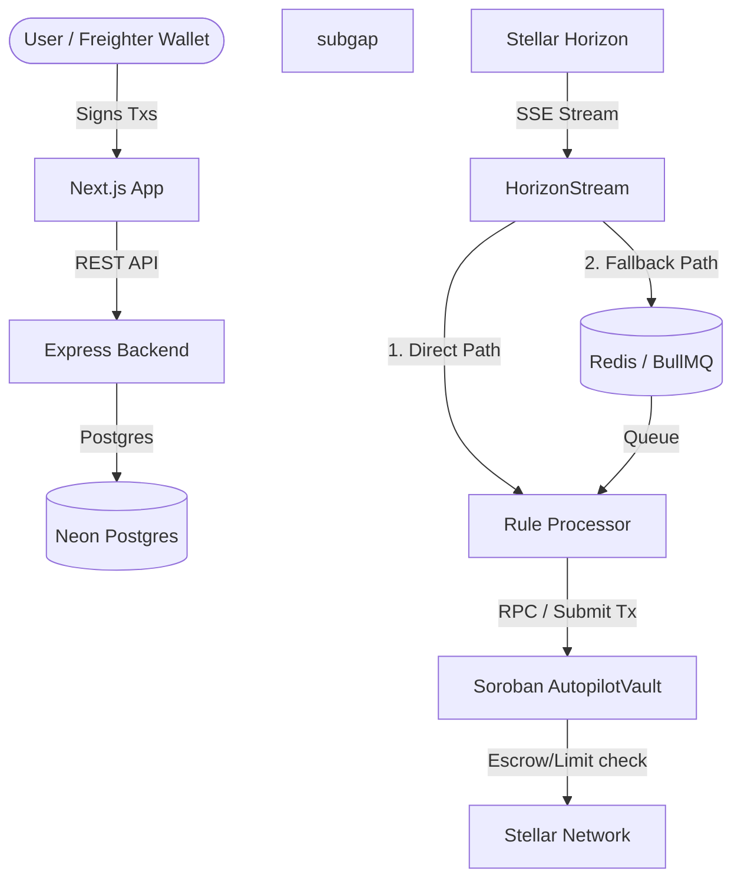

# AutoPilot Architecture

AutoPilot uses a dual-path streaming architecture to guarantee real-time financial automation without sacrificing reliability.

## System Diagram

## Processing Paths

We use a **Dual-path Processing** model when a payment hits a monitored wallet:
1. **Direct Path**: The Horizon SSE stream immediately triggers the Rule Processor in memory. This ensures immediate execution (sub-second) even if Redis is down.
2. **BullMQ Path**: Simultaneously, the event is enqueued into BullMQ with deduplication. If the worker crashes mid-execution during the direct path, BullMQ guarantees at-least-once delivery and retries. Deduplication checks via the Postgres `AutomatedTransaction` table ensure rules aren't fired twice.

## Soroban Smart Contracts
The `AutopilotVault` contract holds automated user funds (Savings/Investments) in a non-custodial way. The Engine hot wallet is granted an allowance to execute rules on the user's behalf, bounded by on-chain spending limits.
